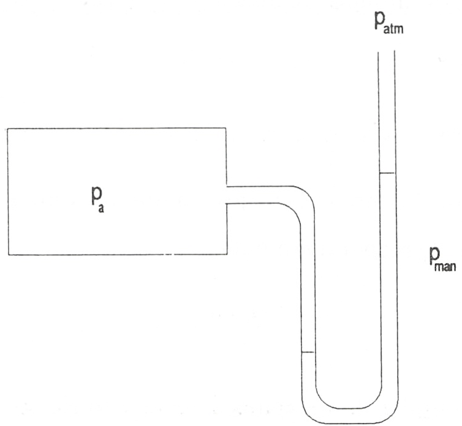
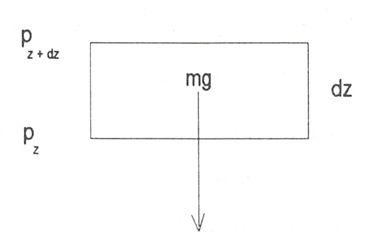

# Presión

Se define la presión *p* en un punto de la superficie límite de un sistema en equilibrio, como la componente normal de la fuerza mecánica ejercida sobre la unidad de área de la superficie en el punto mencionado. Si se designa por $\delta F_n$ la componente normal citada y por $\delta A$ el elemento de superficie en el entorno del punto sobre el que se ejerce $\delta F_n$, *p* vendrá dada por:

$$
p =  \lim_{\Delta A \rightarrow \Delta A'} \frac{\Delta F_n}{\Delta A}
$$

en la que $\Delta A'$ es el elemento de superficie más pequeño compatible con la hipótesis de distribución continua de materia.

La definición de *p* enunciada también se aplica en el interior de un fluido.

Conviene destacar que, ya que un fluido en equilibrio no puede soportar esfuerzos tangenciales, la única fuerza que actúa sobre un elemento de área $\Delta A$ en un punto de la frontera, es normal a la mencionada superficie.

De forma análoga, la fuerza que actúa sobre un área $\Delta A$ en un punto del interior de un fluido en equilibrio, es normal al área e independiente de la orientación de dicha superficie, por lo que la presión en cualquier punto en una superficie, en el interior de un fluido en equilibrio, depende solamente de la posición de $\Delta A$ y no de la orientación. A este tipo de presión se la suele denominar hidrostática y se simboliza con la letra *p*.

Como consecuencia de lo dicho, resulta evidente que en ausencia de campos de fuerza o paredes rígidas interiores, la presión de un fluido en equilibrio, es uniforme sobre su límite y en el interior del mismo.

## Presión manométrica y absoluta

En ingeniería es normal que la presión de un sistema se mida respecto a la atmosférica ($p_{atm}$) en vez de hacerlo respecto al vacío, denominándose entonces presión manométrica, $p_{man}$. En la figura 1.2 se representa un esquema del sistema utilizado frecuentemente en la determinación de la presión y de ella se deduce con facilidad:

$$
p_a = p_{man}+p_{atm}
$$

.. figure:: ./img/presion_absoluta_manometrica.png
   :width: 70%
   :align: center

   Relación entre presión absoluta $p_a$ y presión manométrica $p_{man}$

{ align=center }

Es preciso insistir en que la magnitud que utiliza la termodinámica es la presión absoluta (que es la que define el estado del sistema) y no la manométrica, por lo que hay que ser muy cuidados a la hora de utilizar esta magnitud.

La determinación de la presión mediante la lectura de una columna de líquido, como indica la figura 1.2, es el fundamento de muchos instrumentos utilizados para la medida de presiones.

Para evaluar los cambios de presión dentro del fluido (gas o líquido), en presencia del campo gravitatorio, se hace un balance de fuerzas en un elemento de la columna fluida:

.. figure:: ./img/elemento_columna.png
   :width: 50%
   :align: center

   Elemento de columna de fluido en el campo gravitatorio

{ align=center, style="transform: scale(0.5);" }

$$
\begin{align}
p_z \delta A &= p_{z+dz} \delta A + \rho g \delta A dz\\
p_z &= p_{z+dz} + \rho g dz\\
-dp &= \rho g dz\\
\end{align}
$$

en donde:

- $\rho = rho(z)$: el aire  lejos es menos denso
- $g=g(z)$ (recordar ecuaciones)

Para diferencias de altura suficientemente pequeñas: $\rho$ y *g* son constantes. En ese caso, integrando:

$$
p_2-p_1 = -pg(z_2-z_1)
$$

Esta ecuación define la diferencia de presión entre dos puntos de una columna de fluido en el campo gravitatorio, supuesto que $\rho$ y *g* se mantengan constantes.

Cuando la presión del recinto en el que se efectúa la medición es inferior a la atmosférica, se suele hablar de presión de vacío:

.. figure:: ./img/relacion_presiones.png
   :width: 70%
   :align: center

   Relación entre las presiones absoluta, manomètrica y de vacío

Presión de vacío: es la presión manométrica cuando la presión absoluta es la atmosférica.

Unidades
--------

En el sistema internacional la presión se expresa en pascales:

$$
1Pa = 1N \cdot m^{-2}
$$

pero debido a la pequeñez de esta unidad se utiliza:

$$
1 kPa &= 10^3 Pa \\
1 MPa &= 10^6 Pa
$$

Otras unidades usuales (fuera del sistema internacional):

$$
1 bar &= 10^5 Pa \\
1 psi &= 6894.76 Pa
$$

La presión atmosférica estándar es:

$$
p_{atm} = 1.01325 bar
$$